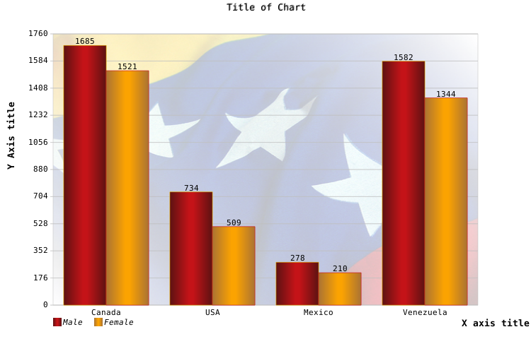

# HTMLtable2chart

Version: 0.1.0

HTMLtable2chart is a javascript library written to convert data that is in a HTML table into chart which is an image over a HTML5 canvas tag

It was created to replace some charts made with the PHP JpGraph library.

## Prerequisites
As this library will run in a client's browser, it will depend mainly whether that browser implement `<canvas>` tag 

## What's included
```
HTMLtable2chart/
├── doc/
├── img/
│   ├── bandera.png
│   ├── barras.png
│   ├── 
│   └── 
├── js/
│   └──HTMLtable2chart/
│       ├── graficarBarras.js
│       ├── graficarTortas.js
│       ├── graficarXY.js
│       └── tabla2array.js
├── readme.html
└── README.md
```

## How to use
If you have a html table like this:

  -  | Canada|USA|Mexico|Venezuela|
----  |----| ---|----|----|
Male  |1685| 734| 278|1582|
Female|1521| 509| 210|1344|

Created with the following **html** code 

```html
<table id="myTable">
	<thead>
		<tr>
			<th></th>
			<th>Canada</th>
			<th>USA</th>
			<th>Mexico</th>
			<th>Venezuela</th>
		</tr>
	</thead>
	<tbody>
		<tr>
			<td>Male</td>
			<td>1685</td>
			<td>734</td>
			<td>278</td>
			<td>1582</td>
		</tr>
		<tr>
			<td>Female</td>
			<td>1521</td>
			<td>509</td>
			<td>210</td>
			<td>1344</td>
		</tr>			
	</tbody>
</table>
```
Download this pack and you just put the `.js` files into appropriated path in your project, then add  to `<head>` element in your document the following script tags, as you have done before with any other javascript library

```html
<script type="text/javascript" src="js/HTMLtable2chart/graficarTortas.js"></script>
<script type="text/javascript" src="js/HTMLtable2chart/tabla2array.js"></script>
```

You must add a canvas element to the place where you want the chart to be.

```html
<canvas id="grafico2" width="750" height="480" style="border: 1px solid black;">Canvas is not supported</canvas>
```

Finally, you add at the end of your document the following code, to set some parameters and call function to build the chart


```js
<script type="text/javascript">
	var misParam ={
		miMargen : 0.80,
		separZonas : 0.05,
		tituloGraf : "Title of Chart",
		tituloEjeX : "X axis title",
		tituloEjeY : "Y Axis title",
		nLineasDiv : 10,
		mysColores :[
			            ["rgba(93,18,18,1)","rgba(196,19,24,1)"],  //red
			            ["rgba(171,115,51,1)","rgba(251,163,1,1)"], //yellow
		            ],
		anchoLinea : 2,
	};
	
	obtener_datos_tabla_convertir_en_array('myTable',graficarBarras,'grafico2','750','480',misParam,false);
</script>
```

Then, you will have
[](img/barras.png)


And that's all.

## What's type of charts are available?
In this version you can find:

* Column
* Pie
* Line (XY)

## Authors
- Rodney Salcedo @Rod2012

See the plural, others contributors are welcome...

## License
This software is released under GNU Affero General Public License [AGPLv3](https://www.gnu.org/licenses/agpl-3.0.html)

## Acknowledgments
* PHP JpGraph library, now powered by Asial Corporation
